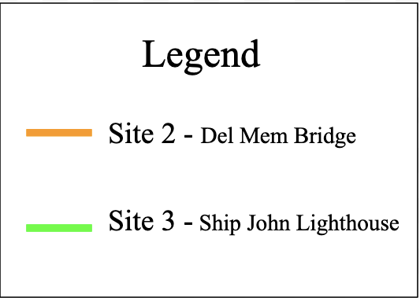

```{r, include=FALSE}
library(tidyverse)
library(dataRetrieval)
library(trend)
library(lubridate)
library(readr)
library(here)
library(dbplyr)
library(scales)
library(ggthemes)
library(ggplot2)
library(patchwork)
library(hrbrthemes)

knitr::opts_chunk$set(echo = TRUE, message = FALSE, warning = FALSE, results = FALSE)
```


```{r, eval=FALSE}

write_csv(q,here('data','discharge.csv'))

write_csv(sc1,here('data',"spefcond1.csv"))

write_csv(sc2,here('data',"spefcond2.csv"))

write_csv(sc3,here('data',"spefcond3.csv"))
```


# Results

## Discharge at Upstream Site

### Data Retrieval
```{r, eval=FALSE}
#Upstream Site
site_no1 <- "01463500" 

q1 <- readNWISdv(siteNumbers = site_no1, 
                parameterCd = '00060', 
                startDate = '1995-09-30', 
                endDate = '2021-01-01') %>% 
  rename(q_cfs = X_00060_00003) %>% 
  addWaterYear(.) %>%
  select(-agency_cd, -X_00060_00003_cd)
```

```{r}
#Monthly averages at Upstream site

q_month_means <- q1 %>%
  mutate(month = month(Date),
         year = year(Date)) %>%
  group_by(year, month) %>%
  summarize(q_mean = mean(q_cfs, na.rm = T),
            q_min = min(q_cfs, na.rm = T),
            q_median = median(q_cfs))
```

### Mann-Kendall Test of September Trends 
```{r}
#Upstream Site plot of September Trends
q_sept <- q_month_means %>%
  filter(month == 9)

ggplot(q_sept, aes(x = year, y = q_mean)) +
  geom_point() +
  scale_y_log10()+
  ylab('Discharge (cfs)') +
  xlab('Water Year')

#Mann-Kendall Test
mk.test(log10(q_sept$q_mean))

sens.slope(log10(q_sept$q_mean))

up_sept_mk <- sens.slope((q_sept$q_mean))

print(up_sept_mk)
```
There does not seem to be a specific trend for the month of September at this site on the Delaware River. It does look like the best fit line would be a straight line around 225 cfs, with some outliers that are either much higher or lower. The reason for there not being much of a trend here is due to how large the Delaware River is, making it difficult for it to be affected by anything. (1 cfs per year?)
p=0.8948

### Mean Discharge
```{r}
#Upstream Site
ggplot(q_month_means, aes(x = year, y = q_mean)) +
  geom_point() +
  facet_wrap(~month, scales = 'free') +
  scale_y_log10()+
  ylab('Mean Discharge (cfs)') +
  xlab('Year')
```

### Minimum Discharge
```{r}
#Upstream Site
ggplot(q_month_means, aes(x = year, y = q_min)) +
  geom_point() +
  facet_wrap(~month, scales = 'free') +
  scale_y_log10()+
  ylab('Minimum Discharge (cfs)') +
  xlab('Year')
```

### Median Discharge
```{r}
#Upstream Site
ggplot(q_month_means, aes(x = year, y = q_median)) +
  geom_point() +
  facet_wrap(~month, scales = 'free') +
  scale_y_log10()+
  ylab('Median Discharge (cfs)') +
  xlab('Year')
```
At this site in the Delaware River at Trenton, there are not many trends that can 
be seen over the months. For the mean, the values are all over the place and the 
only kind of trends would be straight lines with outliers. For the minimum values, 
the data seems to be a little more concise than with the mean values. So it would 
be easier to put a trend line in, but it is still all over the place where I can't 
say whether the values are increasing or decreasing. For the median values, they 
are also all over  the place like with the mean values. In March, April, and September 
there is a slight increasing trend that can be seen. The rest have no trends due 
to the Delaware River being so large.  

## Specific Conductivity Trends

### Upstream site
```{r}
site_no1 <- "01463500"

Spec_Cond1 <- read.csv('data/spefcond1.csv')

sc1 <- readNWISuv(siteNumbers = site_no1, 
                parameterCd = '00095', 
                startDate = '1995-09-30', 
                endDate = '2021-01-01') %>% 
  rename(sc_um = X_00095_00000) %>% 
  addWaterYear(.) %>% 
  select(-agency_cd, -X_00095_00000_cd)

sc_mean_t <- sc1 %>%
  mutate(month = month(dateTime),
         year = year(dateTime)) %>%
  group_by(year, month) %>%
  summarize(sc_mean1 = mean(sc_um, na.rm = T),
            sc_min1 = min(sc_um, na.rm = T),
            sc_median1 = median(sc_um))

ggplot(sc_mean_t, aes(x = year, y = sc_mean1)) +
  geom_point() +
  facet_wrap(~month, scales = 'free') +
  scale_y_log10()+
  ylab('Mean Specific Conductivity') +
  xlab('Year')
```

The specific conductance data also does not show much of a trend throughout the year.
However, if you look at them closely, most do seem to have a slight increase in their
values. 

### Middle site
```{r, eval=FALSE}
site_no2 <- "01482100" 

Spec_Cond2 <- read.csv('data/spefcond2.csv')

sc2 <- readNWISuv(siteNumbers = site_no2, 
                parameterCd = '00095') %>% 
  mutate(dateTime = lubridate::as_datetime(dateTime),
         date = lubridate::as_date(dateTime))%>%
  group_by(site_no, dateTime)%>%
  summarize(sc_um_min_2 = min(X_Lower.Sensor_00095_00000),
            sc_um_mean_2 = mean(X_Lower.Sensor_00095_00000),
            sc_um_max_2 = max(X_Lower.Sensor_00095_00000))

sc_mean_dm <- sc2 %>%
  mutate(month = month(dateTime),
         year = year(dateTime)) %>%
  group_by(year, month) %>%
  summarize(sc_mean2 = mean(sc_um_mean_2, na.rm = T),
            sc_min2 = min(sc_um_min_2, na.rm = T),
            sc_max2 = max(sc_um_max_2))

ggplot(sc_mean_dm, aes(x = year, y = sc_mean2)) +
  geom_point() +
  facet_wrap(~month, scales = 'free') +
  scale_y_log10()+
  ylab('Mean Specific Conductivity') +
  xlab('Year')
```


### Estuary site
```{r, eval=FALSE}
site_no3 <- "01412350" 

Spec_Cond3 <- read.csv('data/spefcond3.csv')

sc3 <- readNWISuv(siteNumbers = site_no3, 
                parameterCd = '00095', 
                startDate = '2021-03-01', 
                endDate = '2022-04-07') %>% 
  rename(sc_um_3 = X_Lower_00095_00000) %>% 
  addWaterYear(.) %>%
  select(-agency_cd, -X_Upper_00095_00000_cd, -X_Upper_00095_00000,
        -X_Lower_00095_00000_cd, -tz_cd)

sc_mean_sj <- sc3 %>%
  mutate(month = month(dateTime),
         year = year(dateTime)) %>%
  group_by(year, month) %>%
  summarize(sc_mean3 = mean(sc_um_3, na.rm = T),
            sc_min3 = min(sc_um_3, na.rm = T),
            sc_max3 = max(sc_um_3))

ggplot(sc_mean_sj, aes(x = year, y = sc_mean3)) +
  geom_point() +
  facet_wrap(~month, scales = 'free') +
  scale_y_log10()+
  ylab('Mean Specific Conductivity') +
  xlab('Year')
```

### Comparing middle and estuary site's Specific Conductivity
```{r, fig.cap= "Figure _ "}
sc_mean_dm <- sc_mean_dm %>% 
  mutate(day = 1)

sc_mean_dm$Date <- as.Date(with(sc_mean_dm, paste(year, month, day, sep= "-")), '%Y-%m-%d')

sc_mean_sj <- sc_mean_sj %>% 
  mutate(day = 1)

sc_mean_sj$Date <- as.Date(with(sc_mean_sj, paste(year, month, day, sep= "-")), '%Y-%m-%d')

sc_dm_sj <- right_join(sc_mean_dm, sc_mean_sj, by ='Date')
  
p1 <- ggplot(sc_dm_sj) +
    geom_line(aes(x = Date, y = sc_mean2*10), color = "Orange", size = 1.5)+
    geom_line(aes(x = Date, y = sc_mean3), color = "Green", size = 1.5)+
    ylab('SC') +
    xlab('Water Year')+
    theme_classic()+
    scale_color_identity(guide = "legend")

    
p1 + scale_y_continuous(name = "Estuary Site", sec.axis = sec_axis(trans =~. / 10, name= "Middle Site"))+
  theme_few(base_size =20)+
  ggtitle("Specific Conductivity")

```
{width=30%}
```{r}
#Mann-Kendall Test (Middle Site)
mk.test(log10(sc_dm_sj$sc_mean2))

sens.slope(log10(sc_dm_sj$sc_mean2))

sc_2_mk <- sens.slope((sc_dm_sj$sc_mean2))

#Mann-Kendall Test (Estuary Site)
mk.test(log10(sc_dm_sj$sc_mean3))

sens.slope(log10(sc_dm_sj$sc_mean3))

sc_3_mk <- sens.slope((sc_dm_sj$sc_mean3))

print(sc_2_mk)
print(sc_3_mk)
```


## Discharge vs. Specific Conductivity Trends at Upstream Site

```{r, fig.cap= "Figure _ "}
#Upstream Site
q_month_means <- q_month_means %>%
  mutate(day =1)

q_month_means$Date <- as.Date(with(q_month_means, paste(year, month, day, sep= "-")), '%Y-%m-%d')


sc_mean_t <- sc_mean_t %>%
  mutate(day = 1)

sc_mean_t$Date <- as.Date(with(sc_mean_t, paste(year, month, day, sep= "-")), '%Y-%m-%d')


q_sc_t <- right_join(q_month_means, sc_mean_t, by = 'Date')

p2 <- ggplot(q_sc_t) +
  geom_line(aes(x = Date, y = q_mean),  color ="blue") +
  geom_line(aes(x = Date, y = sc_mean1*100), color = "red")+
  xlab('Water Year')+
  scale_y_log10()+
  ylab('Q') +
  theme_classic()

p2 + scale_y_continuous(name = "Discharge (cfs)", sec.axis = sec_axis(trans =~. / 100, name= "Specific Conductivity"))+
  theme_few(base_size =20)+
  scale_color_identity(guide = "legend")+
  ggtitle("Upstream Site")

```

```{r}
#Mann-Kendall Test (Upstream Site Discharge)
mk.test(log10(q_sc_t$q_mean))

sens.slope(log10(q_sc_t$q_mean))

up_q_mk <- sens.slope((q_sc_t$q_mean))

#Mann-Kendall Test (Upstream Site SC)
mk.test(log10(q_sc_t$sc_mean1))

sens.slope(log10(q_sc_t$sc_mean1))

up_sc_mk <- sens.slope((q_sc_t$sc_mean1))

print(up_q_mk)
print(up_sc_mk)
```

