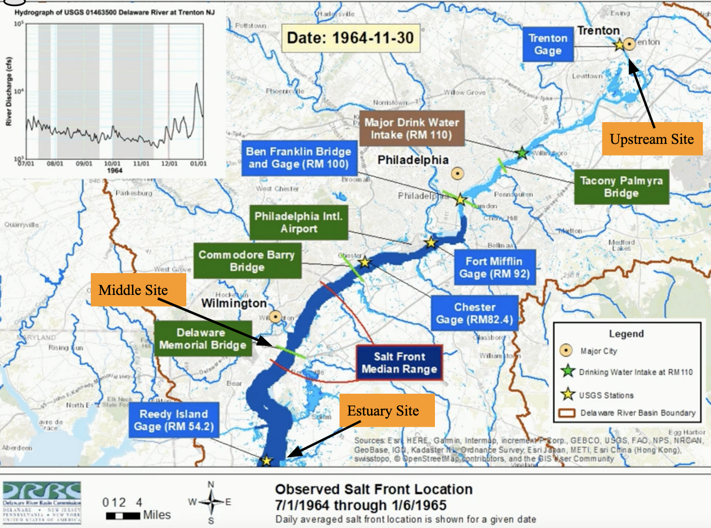
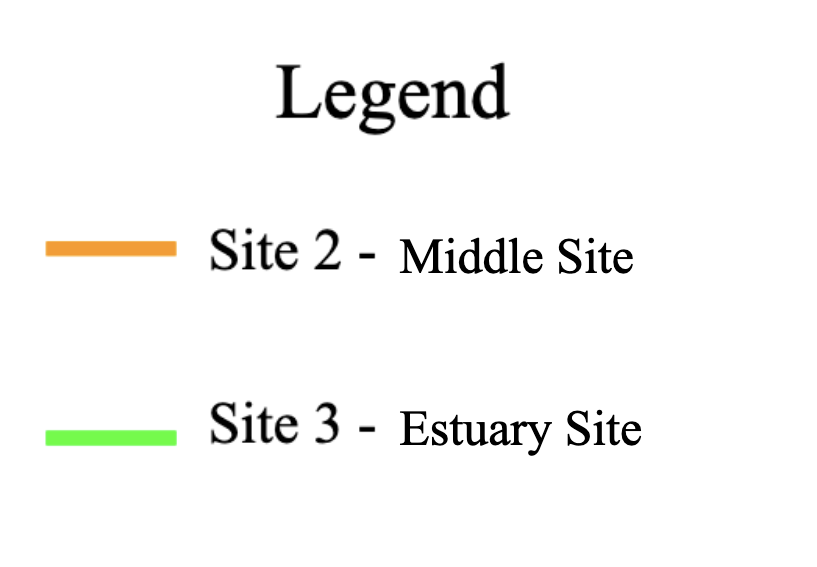

# Introduction

For years, the world has been watching our climate change into what it is today.
There are people who prefer not believe in it and there are people who are very 
passionate about it. The changes that have been recorded are small, but important
for many systems on Earth. These include an increase of around one degree Celsius
and an increase in sea level by 6 to 8 inches [@epa_climate_2021]. These play a 
big part in changing parts of our lives that we don't notice on a day to day basis.

With the sea level rising, the amount of coastal erosion has increased by a large 
amount. This has been decimating beaches and taking down coastal cliffs by breaking
down the sediments, forcing these structures to loose their stability. Leading to 
a loss of deltas, marshes, and wetlands that house important ecosystems. Saltwater 
is corrosive over time and also makes it more difficult for buildings and equipment 
to keep their strength. This means that buildings and equipment need constant upkeep
so they don't erode like the river banks [@epa_climate_2021-1]. 

Looking at the tide coming into the Delaware Bay, sea water flows towards the
freshwater and will flow upstream at the bottom of the river. This is due to the
difference in densities of water, with saltwater being more dense than freshwater. 
As more construction is done along the banks of the Delaware, the more 
susceptible the river is to saltwater intrusion. The Delaware river flows for 301 
miles along Delaware, New Jersey, and Pennsylvania; there is a large amount of people 
that rely on this river for their everyday water. All of Philadelphia's water and 50% 
of New York City's water comes from the Delaware River, making it a very important 
source of water. However, this means that there is more groundwater pumping which 
pulls saltwater further into the Delaware. Therefore increasing saltwater intrusion 
and erosion along the river banks. 

Now if we focus on the Delaware River in New Jersey, we can look at the saltwater 
intrusion and how it has changed over the last few years. In **Figure 1.**, the 
salt front is shown in the Delaware River, which differs everyday. The day shown,
November 30th in 1964, displays the salt front about half way through the Middle 
and Upstream site. I want to see how much more upstream the salt front travels in 
2021. Through discharge and conductivity data, we can understand how rising sea 
levels are impacting the salt front on the Delaware [@gay_comparison_2009].



**Figure 1.** Salt Front on the Delaware River as seen on November 30th, 1964 from 
the Delaware River Basin Commission using USGS data. Upstream, Middle, and Estuary sites are labeled.

## Question

With sea levels rising globally, how has saltwater intrusion affected the Delaware
River and the people that rely on it's water?

<!--chapter:end:index.Rmd-->

---
title: "0_abstract"
output: html_document
date: '2022-05-03'
---
```{r setup, include=FALSE}
knitr::opts_chunk$set(echo = TRUE, message = FALSE, warning = FALSE, results = TRUE)
```

#Abstract

Here is my abstract

<!--chapter:end:0_abstract.Rmd-->

# Methods

```{r setup, include = F}
library(tidyverse)
library(sf)
library(dataRetrieval)
library(nhdplusTools)
library(mapview)

knitr::opts_chunk$set(echo = TRUE, message = FALSE, warning = FALSE, results = TRUE)
```

## Watershed Delineation
```{r, eval=FALSE}
#Data for delineation
site_coords_db3 <- readNWISsite("01463500") %>%
  st_as_sf(coords = c('dec_long_va', 'dec_lat_va'), remove= FALSE, crs = 4326) %>%
  st_transform(crs = 4269)


dbae <- get_huc8(site_coords_db3[1,])


flowlines_db3 <- get_nhdplus(AOI = dbae, 
                         realization = 'flowline')
  
catchments_db3 <- get_nhdplus(AOI = dbae, 
                         realization = 'catchment') 
```

### Watershed Map
```{r, fig.cap= "**Figure 1.** Delineated watershed map of the Delaware River upstream."}
watershed <- st_read('NJdata.geojson') %>%
  dplyr::filter(id == 'globalwatershed' )

mapview(watershed)
```
**Figure 1.** displays how large the catchment area of the Delaware River is and 
allows one to recognize the major cities surrounding it, showing how many people 
rely on it's water. 

## Data Acquisition
```{r}
site_no1 <- "01463500" 

q <- readNWISdv(siteNumbers = site_no1, 
                parameterCd = '00060', 
                startDate = '1995-09-30', 
                endDate = '2021-01-01') %>% 
  rename(q_cfs = X_00060_00003)

sc <- readNWISdv(siteNumbers = site_no1,
                parameterCd = '00095',
                startDate = '1995-09-30', 
                endDate = '2021-01-01') %>%
  rename(sc = X_00095_00003)
```
Discharge data and level data is collected from the upstream site in the Delaware River from the USGS primary gauge.

## Data Plot
```{r, fig.cap= "**Figure 2.** Discharge data for the Delaware River from 1995 to 2021 at the Upstream site."}
ggplot(q, aes(x = Date, y = q_cfs)) + 
  geom_line() + 
  ylab('Discharge (cfs)')
```
Starting with looking at discharge at the upstream site, **Figure 2.** shows a 
large amount of variation, but it is hard to understand what any of it means. Next,
I will be splitting the mean discharge data between the 12 months to see how they 
compare. 

<!--chapter:end:1_methods.Rmd-->

---
output: html_document
editor_options: 
  chunk_output_type: console
---

```{r, include=FALSE}
library(tidyverse)
library(dataRetrieval)
library(trend)
library(lubridate)
library(readr)
library(here)
library(dbplyr)
library(scales)
library(ggthemes)
library(ggplot2)
library(patchwork)
library(hrbrthemes)

knitr::opts_chunk$set(echo = TRUE, message = FALSE, warning = FALSE, results = TRUE)
```


```{r, eval=FALSE}

write_csv(q,here('data','discharge.csv'))

write_csv(sc1,here('data',"spefcond1.csv"))

write_csv(sc2,here('data',"spefcond2.csv"))

write_csv(sc3,here('data',"spefcond3.csv"))
```

# Results

## Discharge at Upstream Site

### Data Retrieval
```{r, eval=FALSE}
#Upstream Site
site_no1 <- "01463500" 

q1 <- readNWISdv(siteNumbers = site_no1, 
                parameterCd = '00060', 
                startDate = '1995-09-30', 
                endDate = '2021-01-01') %>% 
  rename(q_cfs = X_00060_00003) %>% 
  addWaterYear(.) %>%
  select(-agency_cd, -X_00060_00003_cd)
```

```{r}
#Monthly averages at Upstream site
q_month_means <- q1 %>%
  mutate(month = month(Date),
         year = year(Date)) %>%
  group_by(year, month) %>%
  summarize(q_mean = mean(q_cfs, na.rm = T),
            q_min = min(q_cfs, na.rm = T),
            q_median = median(q_cfs))
```

### Mean Discharge
```{r, fig.cap= "**Figure 4.** Trends for all 12 months mean discharge data from 1995 to 2021 for the upstream site in the Delaware River."}
#Trend of all 12 months at Upstream Site 
ggplot(q_month_means, aes(x = year, y = q_mean)) +
  geom_line() +
  facet_wrap(~month, scales = 'free') +
  scale_y_log10()+
  ylab('Mean Discharge (cfs)') +
  xlab('Year')
```
On **Figure 4.** we see all of the mean discharge values for the water years from 
1995 to 2021. Going month to month, it is difficult to see any notable trends and 
when the Mann-Kendall test is applied, it proves that most of the trends are
non-significant. November through May have much higher mean discharge values from
winter weather, which I am avoiding in my research mainly due to the application of
road salt. June and July values are a little bit lower, but still have a slight
increasing trend over the years. Let's look at the plots for August and September to
see how their mean discharge values behave. 

### Mann-Kendall Test of August and September Trends

```{r, fig.cap= "**Figure 5.** August trends for the upstream site in the Delaware River using mean discharge data from 1995 to 2021."}
#Upstream Site plot of August Trends
q_aug <- q_month_means %>%
  filter(month == 8)

ggplot(q_aug, aes(x = year, y = q_mean), size = 2) +
  geom_line() +
  scale_y_log10()+
  ylab('Mean Discharge (cfs)') +
  xlab('Water Year')

#Mann-Kendall Test
mk.test(log10(q_aug$q_mean))

sens.slope(log10(q_aug$q_mean))

up_aug_mk <- sens.slope((q_aug$q_mean))

print(up_aug_mk)
```
The month of August has a much more visible trend of mean discharge increasing. 
So when we apply the Mann-Kendall test, we find a significant trend with a slope 
of 150.27. Proving that discharge is increasing over time especially in August.

```{r,fig.cap= "**Figure 6.** September trends for the upstream site in the Delaware River using mean discharge data from 1995 to 2021."}
#Upstream Site plot of September Trends
q_sept <- q_month_means %>%
  filter(month == 9)

ggplot(q_sept, aes(x = year, y = q_mean), size = 1.5) +
  geom_line() +
  scale_y_log10()+
  ylab('Mean Discharge (cfs)') +
  xlab('Water Year')

#Mann-Kendall Test
mk.test(log10(q_sept$q_mean))

sens.slope(log10(q_sept$q_mean))

up_sept_mk <- sens.slope((q_sept$q_mean))

print(up_sept_mk)
```
Now Looking at **Figure 6.** for September, there does not seem to be any visible trends 
and the majority of the points lie between 3000 and 6000 cfs with some much higher 
outliers. Applying the Mann-Kendall test gives us a non-significant trend with a 
2.8 slope. Telling us that the average discharge is also increasing for the month 
of September, just not as much as August. 

It makes sense for August to have larger values than September because of how 
large the mean discharge values are for the winter months. They seem to decrease 
to September and then increase again in October re-starting the cycle. 

### Median Discharge
```{r,fig.cap= "**Figure 7.** Trends for the upstream site in the Delaware River using median discharge data from 1995 to 2021."}
#Upstream Site
ggplot(q_month_means, aes(x = year, y = q_median), size = 1.5) +
  geom_line() +
  facet_wrap(~month, scales = 'free') +
  scale_y_log10()+
  ylab('Median Discharge (cfs)') +
  xlab('Year')
```
**Figure 7**, is very similar to **Figure 4.** however, the data plots are closer 
together making it a little easier to see increasing trends for all months. Showing 
that over time, the discharge rate upstream in the Delaware River is increasing. 

With discharge increasing in the Delaware River, let's look at how Specific 
Conductivity plays into this. 

## Specific Conductivity Trends

### Upstream site
```{r, fig.cap= "**Figure 8.** Average specific conductivity trends for the upstream site in the Delaware River using data from 1995 to 2021."}
site_no1 <- "01463500"

Spec_Cond1 <- read.csv('data/spefcond1.csv')

sc1 <- readNWISuv(siteNumbers = site_no1, 
                parameterCd = '00095', 
                startDate = '1995-09-30', 
                endDate = '2021-01-01') %>% 
  rename(sc_um = X_00095_00000) %>% 
  addWaterYear(.) %>% 
  select(-agency_cd, -X_00095_00000_cd)

sc_mean_t <- sc1 %>%
  mutate(month = month(dateTime),
         year = year(dateTime)) %>%
  group_by(year, month) %>%
  summarize(sc_mean1 = mean(sc_um, na.rm = T),
            sc_min1 = min(sc_um, na.rm = T),
            sc_median1 = median(sc_um))

ggplot(sc_mean_t, aes(x = year, y = sc_mean1), size = 2) +
  geom_line() +
  facet_wrap(~month, scales = 'free') +
  scale_y_log10()+
  ylab('Mean Specific Conductivity') +
  xlab('Year')
```
**Figure 8.** shows the mean specific conductivity for the upstream site for the Delaware River, which August and September have the largest values.


### Middle site
```{r, eval=FALSE}
site_no2 <- "01482100" 

Spec_Cond2 <- read.csv('data/spefcond2.csv')

sc2 <- readNWISuv(siteNumbers = site_no2, 
                parameterCd = '00095') %>% 
  mutate(dateTime = lubridate::as_datetime(dateTime),
         date = lubridate::as_date(dateTime))%>%
  group_by(site_no, dateTime)%>%
  summarize(sc_um_min_2 = min(X_Lower.Sensor_00095_00000),
            sc_um_mean_2 = mean(X_Lower.Sensor_00095_00000),
            sc_um_max_2 = max(X_Lower.Sensor_00095_00000))

sc_mean_dm <- sc2 %>%
  mutate(month = month(dateTime),
         year = year(dateTime)) %>%
  group_by(year, month) %>%
  summarize(sc_mean2 = mean(sc_um_mean_2, na.rm = T),
            sc_min2 = min(sc_um_min_2, na.rm = T),
            sc_max2 = max(sc_um_max_2))

ggplot(sc_mean_dm, aes(x = year, y = sc_mean2), size = 2) +
  geom_line() +
  facet_wrap(~month, scales = 'free') +
  scale_y_log10()+
  ylab('Mean Specific Conductivity') +
  xlab('Year')
```


### Estuary site
```{r, eval=FALSE}
site_no3 <- "01412350" 

Spec_Cond3 <- read.csv('data/spefcond3.csv')

sc3 <- readNWISuv(siteNumbers = site_no3, 
                parameterCd = '00095', 
                startDate = '2021-03-01', 
                endDate = '2022-04-07') %>% 
  rename(sc_um_3 = X_Lower_00095_00000) %>% 
  addWaterYear(.) %>%
  select(-agency_cd, -X_Upper_00095_00000_cd, -X_Upper_00095_00000,
        -X_Lower_00095_00000_cd, -tz_cd)

sc_mean_sj <- sc3 %>%
  mutate(month = month(dateTime),
         year = year(dateTime)) %>%
  group_by(year, month) %>%
  summarize(sc_mean3 = mean(sc_um_3, na.rm = T),
            sc_min3 = min(sc_um_3, na.rm = T),
            sc_max3 = max(sc_um_3))

ggplot(sc_mean_sj, aes(x = year, y = sc_mean3)) +
  geom_line() +
  facet_wrap(~month, scales = 'free') +
  scale_y_log10()+
  ylab('Mean Specific Conductivity') +
  xlab('Year')
```

### Comparing middle and estuary site's Specific Conductivity
```{r, fig.cap= "**Figure 9.** Mean Specific Conductivity trends for the Delaware River's Middle site and Estuary site from March 2021 to April 2022."}
sc_mean_dm <- sc_mean_dm %>% 
  mutate(day = 1)

sc_mean_dm$Date <- as.Date(with(sc_mean_dm, paste(year, month, day, sep= "-")), '%Y-%m-%d')

sc_mean_sj <- sc_mean_sj %>% 
  mutate(day = 1)

sc_mean_sj$Date <- as.Date(with(sc_mean_sj, paste(year, month, day, sep= "-")), '%Y-%m-%d')

sc_dm_sj <- right_join(sc_mean_dm, sc_mean_sj, by ='Date')
  
p1 <- ggplot(sc_dm_sj) +
    geom_line(aes(x = Date, y = sc_mean2*10), color = "Orange", size = 1.5)+
    geom_line(aes(x = Date, y = sc_mean3), color = "Green", size = 1.5)+
    ylab('SC') +
    xlab('Water Year')+
    theme_classic()+
    scale_color_identity(guide = "legend")

    
p1 + scale_y_continuous(name = "Estuary Site", sec.axis = sec_axis(trans =~. / 10, name= "Middle Site"))+
  theme_few(base_size =20)+
  ggtitle("Specific Conductivity")

```
{width=30%}
Looking at **Figure 9.** which shows specific conductivity at the Middle and Estuary sites, we can see that the Estuary has a lot more saltwater which makes sense for it's location. However, the middle site has more dramatic increases in saltwater that occur in July and January. 

```{r}
#Mann-Kendall Test (Middle Site)
mk.test(log10(sc_dm_sj$sc_mean2))

sens.slope(log10(sc_dm_sj$sc_mean2))

sc_2_mk <- sens.slope((sc_dm_sj$sc_mean2))

#Mann-Kendall Test (Estuary Site)
mk.test(log10(sc_dm_sj$sc_mean3))

sens.slope(log10(sc_dm_sj$sc_mean3))

sc_3_mk <- sens.slope((sc_dm_sj$sc_mean3))

print(sc_2_mk)
print(sc_3_mk)
```


## Discharge vs. Specific Conductivity Trends at Upstream Site

```{r, fig.cap= "**Figure 10.** Comparison of the Delaware River's upstream site discharge and specific conductivity from 1995 to 2021."}
#Upstream Site
q_month_means <- q_month_means %>%
  mutate(day =1)

q_month_means$Date <- as.Date(with(q_month_means, paste(year, month, day, sep= "-")), '%Y-%m-%d')


sc_mean_t <- sc_mean_t %>%
  mutate(day = 1)

sc_mean_t$Date <- as.Date(with(sc_mean_t, paste(year, month, day, sep= "-")), '%Y-%m-%d')


q_sc_t <- right_join(q_month_means, sc_mean_t, by = 'Date')

p2 <- ggplot(q_sc_t) +
  geom_line(aes(x = Date, y = q_mean),  color ="blue") +
  geom_line(aes(x = Date, y = sc_mean1*100), color = "red")+
  xlab('Water Year')+
  scale_y_log10()+
  ylab('Q') +
  theme_classic()

p2 + scale_y_continuous(name = "Discharge (cfs)", sec.axis = sec_axis(trans =~. / 100, name= "Specific Conductivity"))+
  theme_few(base_size =20)+
  scale_color_identity(guide = "legend")+
  ggtitle("Upstream Site")

```
**Figure 10.** shows how discharge and specific conductivity act with each other. 
With the red line marking specific conductivity, all of the highest points are 
when discharge has it's lowest points. This tells us that discharge and speicific 
conductivity have a relationship where salt water intrudes further when flow is 
at it's lowest. Using the Mann-Kendall test, the trend is significant with a slight 
slope of 0.15. 

```{r}
#Mann-Kendall Test (Upstream Site Discharge)
mk.test(log10(q_sc_t$q_mean))

sens.slope(log10(q_sc_t$q_mean))

up_q_mk <- sens.slope((q_sc_t$q_mean))

#Mann-Kendall Test (Upstream Site SC)
mk.test(log10(q_sc_t$sc_mean1))

sens.slope(log10(q_sc_t$sc_mean1))

up_sc_mk <- sens.slope((q_sc_t$sc_mean1))

print(up_q_mk)
print(up_sc_mk)
```


<!--chapter:end:2_results.Rmd-->

# Discussion

Here is my discussion post.

Looking at trends in discharge rates, **Figure 4.** shows how mean discharge has
changed from 1995 to 2021 for each of the twelve months of the year. For this project, 
I decided to not discuss the trends for November through May due to the application 
of road salt in the winter. Because of this, I looked at August and September trends 
more closely


After looking at data for saltwater intrusion in the Delaware River between 
1995 and 2021, the future of this important waterway has become clear. With 
global sea levels rising, the salt front will continue to travel further upstream, 
increasing the opportunity of damage to equipment in the river and issues with 
obtaining drinking water. As said in the introduction, the Delaware River is used 
for 50% of New York City's drinking water and all of Philadelphia's drinking water 
along with many other cities in that area. As salt water travels further upstream, 
there will be a lose in drinkable water, ultimately forcing these important cities to 
find freshwater elsewhere. Doing so will be more expensive and worse for the 
environment as there will be an increase in having to transport water over 
long distances. 


In a river like the Delaware that has a well mixed 
estuary, the response to river discharge is surprisingly weak[@garvine_axial_1992]

Now if we focus on the Delaware River in New Jersey, we can look at the saltwater 
intrusion and how it has changed over the last few years. We can take this and 
compare it to sea levels in order to show how they are related and rely on each 
other[@gay_comparison_2009].In a river like the Delaware that has a well mixed 
estuary, the response to river discharge is surprisingly weak[@garvine_axial_1992].

<!--chapter:end:3_discussion.Rmd-->

---
title: "4_Conclusion"
output: html_document
date: '2022-05-03'
---

#Conclusion


<!--chapter:end:4_Conclusion.Rmd-->


`r if (knitr::is_html_output()) '# References {-}'`

<!--chapter:end:wrapping_up.Rmd-->

