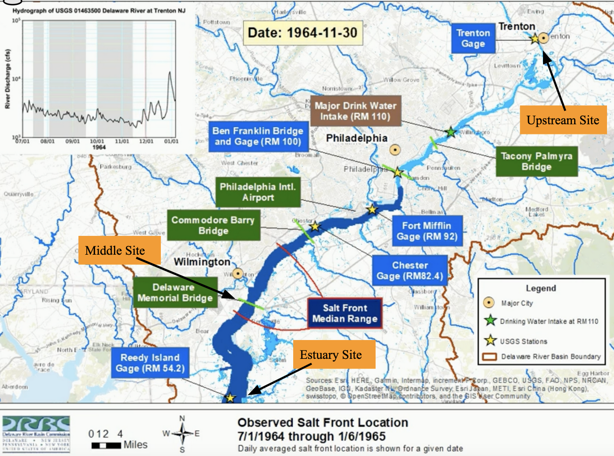

# Introduction

For years, the world has been watching our climate change into what it is today.
There are people who prefer not believe in it and there are people who are very 
passionate about it. The changes that have been recorded are small, but important
for many systems on Earth. These include an increase of around one degree Celsius
and an increase in sea level by 6 to 8 inches [@epa_climate_2021]. These play a 
big part in changing parts of our lives that we don't notice on a day to day basis.

With the sea level rising, the amount of coastal erosion has increased by a large 
amount. This has been decimating beaches and taking down coastal cliffs by breaking
down the sediments, forcing these structures to loose their stability. Leading to 
a loss of deltas, marshes, and wetlands that house important ecosystems. Saltwater 
is corrosive over time and also makes it more difficult for buildings and equipment 
to keep their strength. This means that buildings and equipment need constant upkeep
so they don't erode like the river banks [@epa_climate_2021-1]. 

Looking at the tide coming into the Delaware Bay, sea water flows towards the
freshwater and will flow upstream at the bottom of the river. This is due to the
difference in densities of water, with saltwater being more dense than freshwater. 
As more construction is done along the banks of the Delaware, the more 
susceptible the river is to saltwater intrusion. The Delaware river flows for 301 
miles along Delaware, New Jersey, and Pennsylvania; there is a large amount of people 
that rely on this river for their everyday water. All of Philadelphia's water and 50% 
of New York City's water comes from the Delaware River, making it a very important 
source of water. However, this means that there is more groundwater pumping which 
pulls saltwater further into the Delaware. Therefore increasing saltwater intrusion 
and erosion along the river banks. 

Now if we focus on the Delaware River in New Jersey, we can look at the saltwater 
intrusion and how it has changed over the last few years. In **Figure 1.**, the 
salt front is shown in the Delaware River, which differs everyday. The day shown,
November 30th in 1964, displays the salt front about half way through the Middle 
and Upstream site. I want to see how much more upstream the salt front travels in 
2021. Through discharge and conductivity data, we can understand how rising sea 
levels are impacting the salt front on the Delaware [@gay_comparison_2009].

**Figure 1.** Salt Front on the Delaware River as seen on November 30th, 1964 from 
the Delaware River Basin Commission using USGS data. Upstream, Middle, and Estuary sites are labeled.

## Question

With sea levels rising globally, how has saltwater intrusion affected the Delaware
River and the people that rely on it's water?
